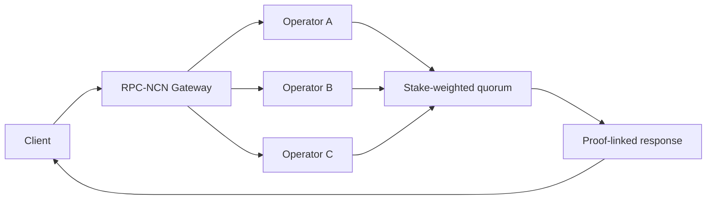

# RPC NCN Protocol

Public docs site: https://bsc-aujl.github.io/RPC-NCN-protocol/

Request access: https://blocksize.info/contact/

---

## RPC NCN at a glance

RPC-NCN is built for organizations that need both high RPC reliability and verifiable integrity.

- **RPC that always works** through resilient request routing.
- **Requests of proven integrity** through quorum-backed verification and proof-linked handling.

## How it works (short)

1. Client sends request.
2. Gateway fans out to independent operators.
3. Responses are compared under stake-weighted agreement.
4. Quorum-backed output is accepted.
5. Response is returned with integrity context.

## Protocol and POC status

Single protocol + single POC status summary:

- core request orchestration: ✅
- integrity-oriented response handling: ✅
- end-to-end protocol path: ✅
- production rollout hardening: 🟡

For the maintained web version, see: https://bsc-aujl.github.io/RPC-NCN-protocol/poc-status.html

## Navigation

- RPC NCN: https://bsc-aujl.github.io/RPC-NCN-protocol/
- Protocol and POC status: https://bsc-aujl.github.io/RPC-NCN-protocol/poc-status.html
- Request access: https://blocksize.info/contact/
