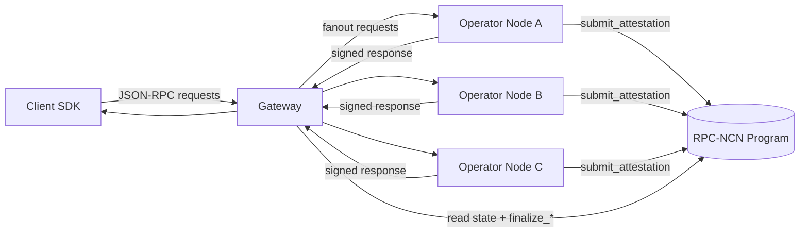

# RPC-NCN Protocol Architecture

This architecture brief reuses the narrative and component relationships documented in [`RPC-NCN-core/docs/internal/reference-system-architecture.md`](https://github.com/BSC-aujl/RPC-NCN-core/blob/main/docs/internal/reference-system-architecture.md) to explain how the public protocol behaves from request ingress to proof finalization.

## Component map

The component map below summarizes the core pieces (client SDK, gateway, operators, on-chain program) and how they exchange requests, verified responses, and attestations. The map is intentionally high-level so it can apply to both the POC and future deployments.

This map implements the same points of contact described in the core repository, highlighting how stake-aware gateway routing, operator hash-chaining, and on-chain finalization work together. Developers can examine the corresponding `.dot` source (`docs/internal/component-diagrams.dot`) and the generated SVG (`docs/internal/component-diagrams.svg`) in `RPC-NCN-core` for a more detailed view.

## Component responsibilities

- **Client SDK:** Issues RPC-NCN requests with interval metadata and verifies proofs using the same quorum BPS as the runtime.
- **Gateway:** Fans out requests to operators, enforces stake-weighted consensus, and coordinates interval plus epoch finalization on the contract.
- **Operator nodes:** Execute forwarded JSON-RPC calls, sign canonical responses, maintain interval hash chains, and submit interval attestations to the on-chain program.
- **On-chain program:** Stores attestations, finalizes intervals/epochs, reconciles rewards, and tracks offenses.

## Request-to-proof flow

  <button class="viz-card" data-viz-src="./specs/images/request-to-proof-flow.svg" data-viz-title="Request-to-proof flow">
    
    Request-to-proof flow – client request through consensus hash and proof finalization (click to zoom + pan)
  </button>

The flow chart shows the linear progression from the client request through gateway fan-out, operator responses, gateway consensus, interval attestations, and the epoch finalization that finalizes rewards and offenses.

> **Sequence diagram source:** The RPC-NCN-core [reference system architecture](https://github.com/BSC-aujl/RPC-NCN-core/blob/main/docs/internal/reference-system-architecture.md#2-end-to-end-request-flow) doc hosts the mermaid sequence diagram that narrates the request, operator, and finalization interactions introduced above.

## Visual references

  <button class="viz-card" data-viz-src="./specs/images/component-diagrams.png" data-viz-title="POC component view">
    
    Component view – gateway, operators, and chain with proof submission paths (click to zoom + pan)
  </button>

  <button class="viz-card" data-viz-src="./specs/images/architecture-diagram.png" data-viz-title="System architecture">
    
    System architecture – client, gateway, operators, and on-chain program (click to zoom + pan)
  </button>

The component diagram pairs with the component map above to make concrete the building blocks that ship in the POC.

The system architecture diagram shows the surface area exposed to public stakeholders alongside the proof-generation path.

See [the general visualizations page](./visualizations.html) for the full set of interactive diagrams currently maintained in this repo.


