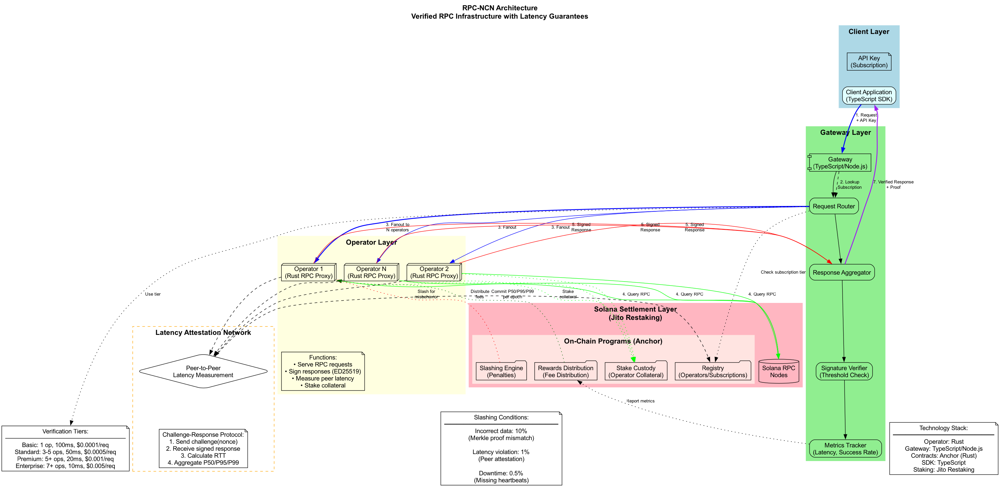

# RPC-NCN Protocol

**Status:** informative landing page. Normative behavior is defined in `specs/`, `schemas/`, `reference-test-vectors/`, `compliance-tests/`, and `versioning/`.

  
Verifiable, high-assurance RPC

  
RPC-NCN adds independent verification on top of standard RPC flows using stake-weighted quorum, signed attestations, and on-chain accountability.

  <a class="ncn-chip" href="./specs/protocol-v1-summary.md">Protocol summary</a>
  <a class="ncn-chip" href="./specs/system-architecture-context.md">Architecture context</a>
  <a class="ncn-chip" href="./poc-status.md">POC status</a>
  <a class="ncn-chip" href="./visualizations.md">Visualizations</a>
  <a class="ncn-chip" href="./related-content.md">Related content</a>

## Start here (quick read path)

1. Read [Protocol v1 Summary](./specs/protocol-v1-summary.md) for the high-level contract.
2. Check [POC Status](./poc-status.md) for implementation maturity and test evidence.
3. Use [System Architecture Context](./specs/system-architecture-context.md) and [Visualizations](./visualizations.md) for system understanding.

## Why RPC-NCN

  
<strong>Integrity</strong>Detects inconsistent operator responses by stake-weighted hash agreement.

  
<strong>Verifiability</strong>Produces signed operator attestations linked to interval and epoch outcomes.

  
<strong>Accountability</strong>Finalizes correctness data on-chain for transparent reward/offense handling.

## Synopsis: request-to-proof flow

  
<strong>1</strong>Client request enters gateway fanout.

  
<strong>2</strong>Operators return response + response hash.

  
<strong>3</strong>Gateway validates quorum at &ge; 2/3 active stake.

  
<strong>4</strong>Attestations are finalized on-chain for auditability.

  

    <h3>POC architecture</h3>
    <ul>
      <li><strong>Gateway:</strong> request fanout + stake-weighted aggregation</li>
      <li><strong>Operators:</strong> RPC execution + signed attestations</li>
      <li><strong>On-chain program:</strong> interval/epoch correctness accounting</li>
      <li><strong>Clients:</strong> response consumption + verification metadata</li>
    </ul>
    
<a href="./specs/system-architecture-context.md">Read architecture context</a>

  

  

    
  

## Core documentation

| Topic | Document |
|---|---|
| Protocol v1 summary | [Protocol v1 Summary](./specs/protocol-v1-summary.md) |
| System architecture context | [System Architecture Context](./specs/system-architecture-context.md) |
| POC status | [POC Status](./poc-status.md) |
| Visual artifacts | [Visualizations](./visualizations.md) |
| Related context | [Related Content](./related-content.md) |
| Canonical protocol draft (normative full text) | `specs/core/poc-protocol-v1-draft.md` |
| Redacted implementation model | `specs/core/ncn-implementation-spec-public-redacted.md` |

## Artifact map (for maintainers/implementers)

- Specs index: `specs/INDEX.md`
- Schemas: `schemas/README.md`
- Reference vectors: `reference-test-vectors/README.md`
- Compliance criteria: `compliance-tests/README.md`
- Versioning policy: `versioning/COMPATIBILITY_POLICY.md`
- Governance flow: `governance/PROTOCOL_UPDATE_FLOW.md`
- RFC process: `rfcs/RFC-TEMPLATE.md`

> Normative protocol behavior is defined in `specs/`, `schemas/`, `reference-test-vectors/`, `compliance-tests/`, and `versioning/`.
