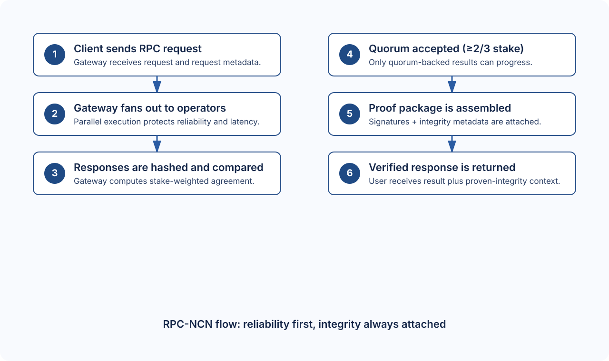
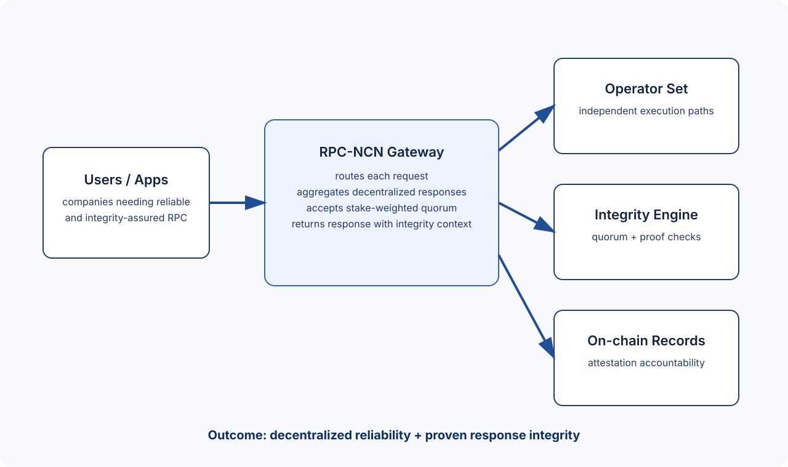

# RPC NCN

  
Reliability and integrity for production RPC

  
RPC-NCN is designed for organizations that cannot afford RPC uncertainty. It combines resilient request handling with cryptographic verification so responses are both available and trustworthy.

## What problem this solves

Standard RPC setups often force a tradeoff between uptime and trust. RPC-NCN is built to remove that tradeoff:

- <strong>RPC that always works</strong> through resilient request routing across independent operators.
- <strong>Requests of proven integrity</strong> through quorum-backed agreement and proof-linked response handling.

## How RPC-NCN works (synopsis)

1. A client sends a request through RPC-NCN.
2. The gateway fans out execution to independent operators.
3. Decentralization provides strong response continuity via multiple independent paths.
4. Responses are compared using stake-weighted agreement.
5. When quorum is reached, integrity context is attached so the response is cryptographically trustworthy.

Even when strict quorum is not reached for a specific attempt, the decentralized operator topology still provides strong assurance of getting a response.

  <button class="viz-card" data-viz-src="./images/request-proof-flow.svg" data-viz-title="Request to proof flow">
    
    Request-to-proof flow (click to zoom + pan)
  </button>

## System overview

  <button class="viz-card" data-viz-src="./images/system-overview.svg" data-viz-title="RPC-NCN system overview">
    
    RPC-NCN system overview (click to zoom + pan)
  </button>

## Who this is for

- Companies and infrastructure teams with strict uptime and integrity requirements.
- Decision-makers evaluating high-assurance RPC options.
- Technical stakeholders who need a clear, implementation-aware protocol overview without full spec depth.

## Next page

For the single implementation summary, go to [Protocol and POC status](./poc-status.md).


