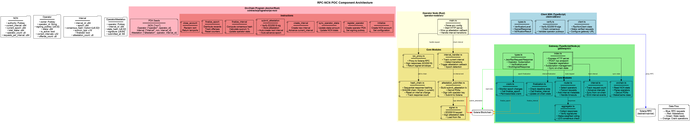
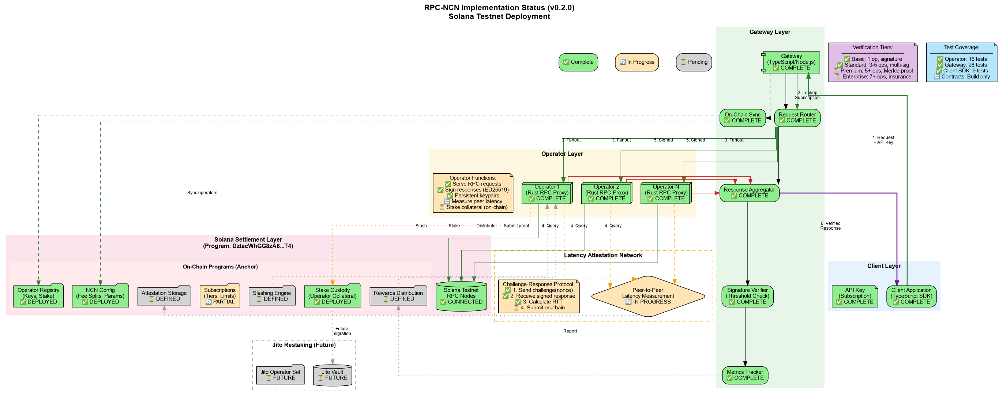

# Protocol v1 + POC status

## Protocol v1 at a glance

RPC-NCN v1 focuses on verifiable response integrity for high-assurance RPC workflows.

### Core mechanics

- stake-weighted response agreement (≥ 2/3)
- operator-side response hash chaining
- interval-based on-chain attestations
- epoch-based reward/offense accounting

## Implementation snapshot

| Component | Status | Evidence |
|---|---|---|
| On-chain program | ✅ Ready | integration tests + public test deployment |
| Gateway | ✅ Ready | stake-weighted aggregation + interval services |
| Operator node | ✅ Ready | hash chaining + attestation flow |
| E2E lifecycle | ✅ Ready | interval/epoch flow verification |

## Test snapshot

| Suite | Count | Scope |
|---|---:|---|
| Contract integration | 40 | registration, attestations, quorum, state |
| Gateway unit tests | 109 | consensus, routing, interval/finalization, security |
| Protocol E2E | 16 | end-to-end lifecycle |

## Deployment snapshot

| Environment tier | Status |
|---|---|
| local development | ✅ Active |
| public test environment | ✅ Active |
| production environment | ⏳ Pending |

## Current limits

- no production slashing integration yet (offense model in POC)
- production readiness still depends on additional hardening, audit, and governance gates

## Detailed visual views

  <button class="viz-card" data-viz-src="./specs/images/component-diagrams.png" data-viz-title="POC component view">
    
    POC component view (click to zoom + pan)
  </button>

  <button class="viz-card" data-viz-src="./specs/images/poc-implementation-status.png" data-viz-title="Implementation status view">
    
    Implementation status view (click to zoom + pan)
  </button>

## More details

- [Repository README (single-page reference)](https://github.com/BSC-aujl/RPC-NCN-protocol#readme)
- [Visualizations page](./visualizations.html)


