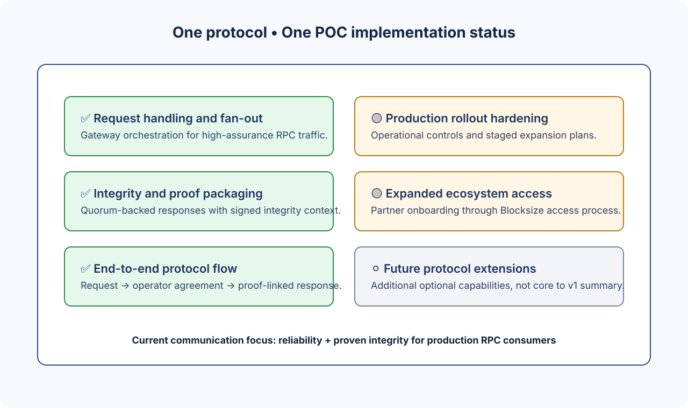

# Protocol and POC status

There is one protocol narrative and one active POC implementation status.
This page keeps the current state explicit, focused, and easy to review.

## Status highlights

- ✅ Core request orchestration flow is in place.
- ✅ Integrity-oriented response handling is in place.
- ✅ End-to-end protocol path is represented in the current POC.
- 🟡 Production rollout hardening and broader access remain staged.

  <button class="viz-card" data-viz-src="./images/poc-status-overview.svg" data-viz-title="Protocol and POC status overview">
    
    Protocol and POC status overview (click to zoom + pan)
  </button>

## What this means

RPC-NCN already demonstrates the core protocol story:

- resilient request handling,
- quorum-backed integrity checks,
- and proof-linked responses.

The remaining work is about controlled expansion and production hardening, not changing the central value proposition.

## Request access

For evaluation, onboarding, or technical conversations, use the Blocksize contact channel:

- [Request access](https://blocksize.info/contact/)


