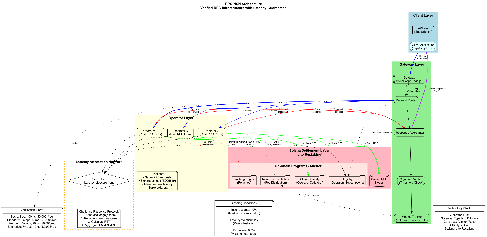
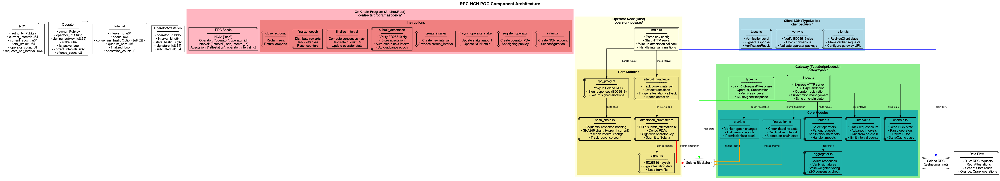
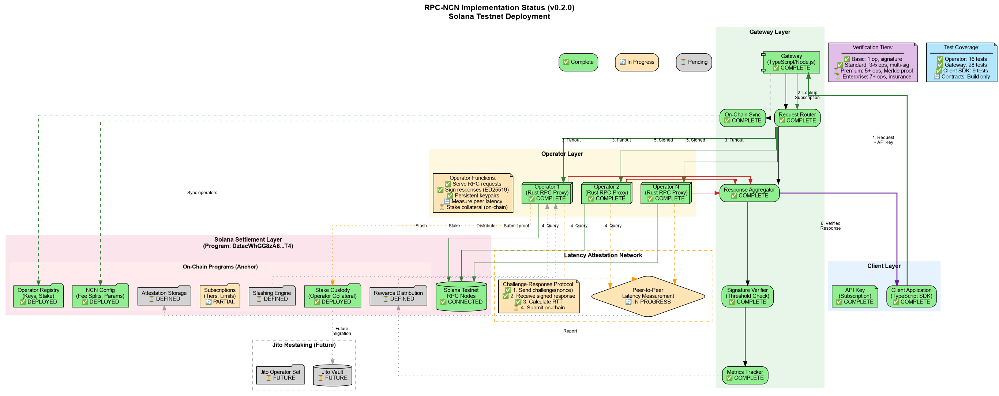

# Visualizations

Click any diagram to open an interactive view with zoom and pan controls.

When the modal opens, use the toolbar buttons or mouse wheel for zooming and the drag gesture to pan; the arrow buttons nudge the view and the reset control returns to the default framing so you can inspect every detail at your own pace.

  <button class="viz-card" data-viz-src="./specs/images/architecture-diagram.png" data-viz-title="System architecture">
    
    System architecture – client → gateway → operators → on-chain program (click to zoom + pan)
  </button>

  <button class="viz-card" data-viz-src="./specs/images/request-to-proof-flow.svg" data-viz-title="Request-to-proof flow">
    
    Request-to-proof flow – client request through cue aggregation to proof finalization (click to zoom + pan)
  </button>

  <button class="viz-card" data-viz-src="./specs/images/component-diagrams.png" data-viz-title="POC component view">
    
    POC component view – component boundaries, data flows, and proof submission paths (click to zoom + pan)
  </button>

  <button class="viz-card" data-viz-src="./specs/images/poc-implementation-status.png" data-viz-title="Implementation status view">
    
    Implementation status view – highlights which components already run in the POC versus the aspirational work items (click to zoom + pan)
  </button>

  
The system architecture visualization captures the complete RPC-NCN stack so readers can trace the client-to-on-chain narrative and the trust boundaries between components.

  
The request-to-proof flow summarizes how a client request fans out to operators, forms a quorum hash, and turns into signed interval attestations plus epoch finalization.

  
The component view surfaces the POC building blocks, including operators, gateway services, and the ledger, so you can follow the interval/epoch proof flow.

  
The implementation status view doubles as an accessibility caption, summarizing which parts are exercised today and which remain future-facing.


